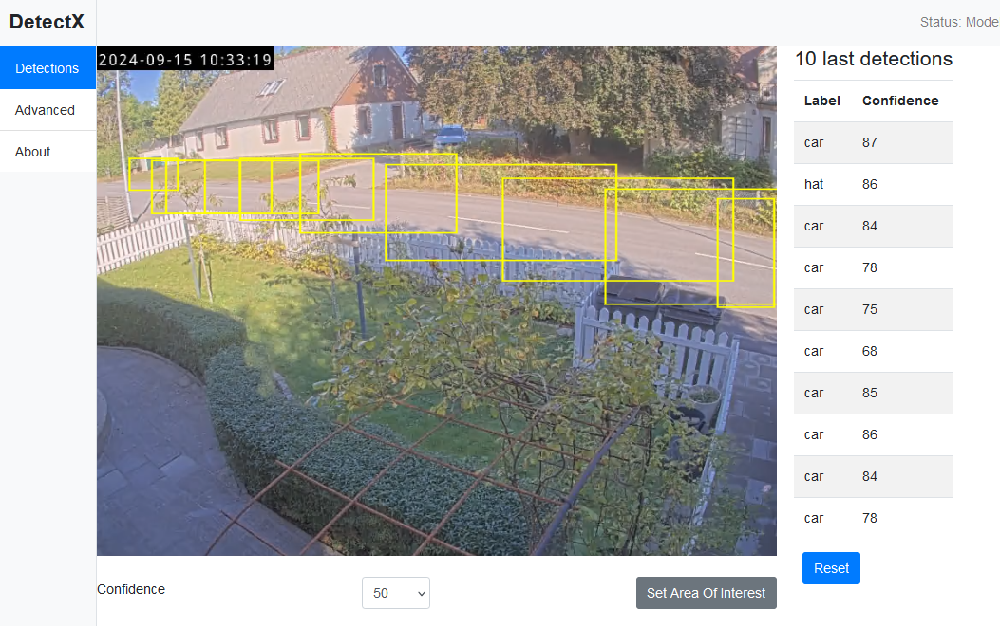
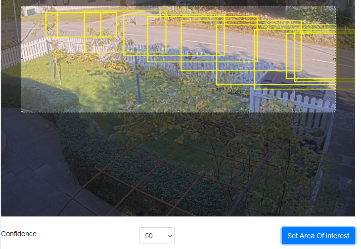
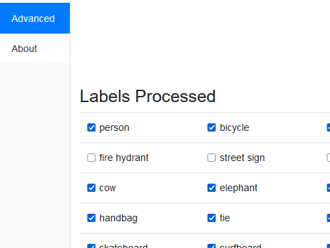
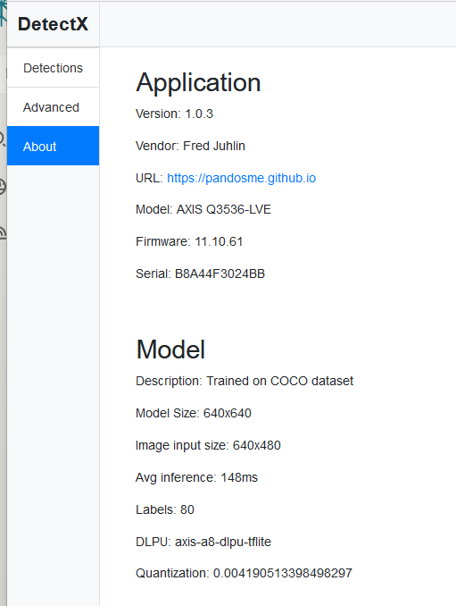

## DetectX

DetectX is an open-source package designed for developers and integrators who wish to train or deploy a YOLOv5 object detection model directly on Axis cameras with ARTPEC-8. While Axis cameras offer robust built-in object detection analytics for common use cases, some scenarios require more specialized detection. This package allows you to leverage a trained YOLOv5 model on the camera itself, bypassing the need for server-based processing.

This package is based on material published on [Axis Communication GitHub](https://github.com/AxisCommunications/acap-native-sdk-examples)

### Key Features

- Capture images directly from the camera and perform inference.
- Process output with non-maximum suppression.
- Trigger camera events when labels are detected, maintaining the event state as long as detections continue.
- User features:
  - Detection verification with video augmentation and tables.
  - Filter detections based on Area-Of-Interest and confidence levels.
  - Monitor ACAP state, model status, and average inference time.

The package is designed to minimize customization needs, encapsulating complexity within wrappers. The primary file you might need to edit is `main.c`.

## Prerequisites

1. Linux with Git, Python, and Docker installed.
2. A labeled dataset of images.

## Training Your Model

To ensure the model is compatible with the camera, follow steps:

```bash
git clone https://github.com/ultralytics/yolov5
cd yolov5
git checkout 95ebf68f92196975e53ebc7e971d0130432ad107
curl -L https://acap-ml-model-storage.s3.amazonaws.com/yolov5/yolov5-axis-A8.patch | git apply
pip install -r requirements.txt
```

More info found in [YOLOv5 on ARTPEC-8](https://github.com/AxisCommunications/axis-model-zoo/blob/main/docs/yolov5-on-artpec8.md)

Create a directory for images and label files.
[Read more here on labels and training](https://docs.ultralytics.com/yolov5/tutorials/train_custom_data/).


### Model Selection

Decide on the image input size and base model (weights). These choices impact performance and detection results. Available base models:

1. yolov5n (nano)
2. yolov5s (small)
3. yolov5m (medium)
4. yolov5l (large)
5. yolov5x (extra large)

Start with yolov5n and move to yolov5s if needed. Choose a model size that is a multiple of 32 (default is 640). Smaller sizes reduce inference time, while larger sizes improve detection quality.

Note: The example ACAP uses yolov5 with an image size of 640x640, with inference times ranging from 110-150ms.

### Training Configuration

Use 80% of images for training and 20% for validation. For example, to train on yolov5n:

```bash
python train.py --img 640 --batch 50 --epochs 300 --data [DIRECTORY TO YOUR DATASET]/data.yaml --weights yolov5n.pt --cfg yolov5n.yaml
```

- `--batch 50`: Number of images processed at once. Higher values increase speed but may exhaust memory.
- `--epochs 300`: Number of complete training cycles. Higher values improve accuracy but increase training time.

## Exporting the Model

After training, export the model to TFLite:

```bash
python export.py --weights runs/train/exp[X]/weights/best.pt --include tflite --int8 --per-tensor --img-size 640
```

Each training session creates a new directory `exp[X]`.

## Building the ACAP

### Installation

Open a Linux shell and navigate to your home directory:

```bash
git clone https://github.com/pandosme/DetectX.git
```

### Building the Package

You do not need to alter any C or H files. However, to create a custom ACAP, you may want to alter:

- `main.c`
- `manifest.json`
- `Makefile`

1. Replace `app/model/labels.txt` with your labels.
2. Replace `app/model/model.tflite` with your model.tflite.
3. Run `python prepare.py` to update `app/html/config/model.json`.
4. Run `./build.sh`.

You should now have a new EAP file ready for installation on your camera.

Remember, tools like Perplexity or other LLMs can assist you with any challenges you encounter.


## Running and configuring the ACAP
Install the EAP in your Camera.

### Detections

Here is where you validate the detections and filter Arae-Of-Intrest and minimum confidence level.  
You will see the last 10 dections in both video and the table to the right.  

**Area-of-Intrest**
  <br>

Press the button "Set Area of Intrest" and it turns blue.  Use the mouse to adjust the area.  End with pressing the button again so it turns gray.  
<br><br>
### Advanced
  
<br>
If you have an SD Card you can capture and store detection images and detection data.  This is primarily useful when debuggin a model or capturing additional images for your dataset.
Images are stored under /var/spool/storage/SD_DISK/DetecX.  There is a file called detections.txt that holds the detection data.  
To get these images, enable SSH on the camera and use a SFTP client to grab them.
*Note that leaving this on for a long time may quickly exhaust the SD Card.  
<br>
The minimum event state controls how long the event for each detected label should be.  The event will stay high until X seconds passed from the last detection.
<br><br>
  <br>
You can enable and disable labels if they cause false detections.

### About
  <br>
Information about the ACAP and the Model.  The "Avg inference" is continously updated.  A value of e.g. 150 ms means that apprx 6-7 images are processed per second.

## Integrating with the ACAP
You can use the cameras Event/Action to trigger various actions.  Look for "DetectX: State change".  The event includes a state and a label.  
Instead of using Events/Actions it may be more useful and easier to configure MQTT publishing upon the event.  You MQTT client will get a payload with label and state.

# History

### 1.0.0	September 5, 2024
- Initial commit

### 1.0.1	Septeber 6, 2024
- Restructured SD Card image store on detect images. Fix a flaw that could result in error "Too many files open...".
- Fixed so Reset button cleared all bounding boxes and table

### 1.0.2	September 7, 2024
- Fixed flaw that prevented detections
- Fixed flaw that did not store images on SD Card when users enabled this feature

### 1.0.3	September 15, 2024
- Restructures the model.json and settings.json and code realted to those config files including prepare.py


### 1.2.0	October 7, 2024
- Added support fo filter minimum size
- Fixed a flaw that preventet detecting mutliple detections in the same scene.
